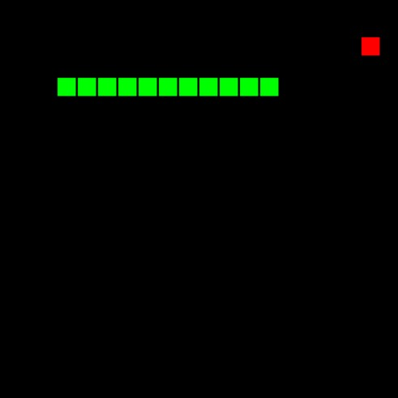

# Snake using VanillaJS and Canvas

    

A very simple implementation of the classic Snake game from old Nokia mobile phones. This is implemented in vanilla html and javascript.

For Future Improvements:

- Add setting to enable/disable the wall shift.
- Add setting to increase/decrease game speed.
- Add setting to change screen size.
- Add scoring system and display to the screen.
- Add high score and display to the screen.
- Improve behavior when snake's head hits the body.
- Add feature to pause and restart the game.

This implementation is based from a youtube video by Chris DeLeon of HomeTeam GameDev:
https://www.youtube.com/watch?v=xGmXxpIj6vs&t=256s
